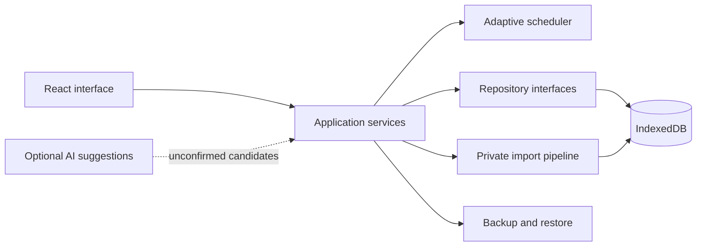

# Architecture

## Decision

Build the first usable version as a local-first Progressive Web App.

## Proposed stack

- TypeScript and React for the interface
- Vite for development and builds
- IndexedDB for local persistence
- A repository layer separating application logic from storage
- A Web Worker for scheduling and import work when needed
- Vitest for unit tests
- Playwright for critical user flows
- PWA manifest and service worker for installation and offline use

## Boundaries



## Local-first rules

- The app must start and support core study without authentication.
- Imported lists, questions, attempts, and personal notes stay on device.
- Export is explicit and user-controlled.
- Cloud sync, if added, is an optional adapter rather than a core dependency.
- AI features never receive personal question content without a separate,
  explicit user action and clear disclosure.

## Scheduling engine

The first implementation should use a proven spaced-repetition foundation
inspired by FSRS rather than inventing retention mathematics from nothing.
GRE-specific priority adjustments are applied above that memory model:

- word-sense frequency;
- lexical interference;
- question-linked mistakes;
- confidence and response time;
- exam proximity;
- activity-type balance.

Every priority adjustment must be testable and visible through a human-readable
schedule reason.

## Repository layout target

```text
gre-verbal-lab/
  src/
    app/
    domain/
    features/
    infrastructure/
    ui/
  tests/
  docs/
  public/
```

