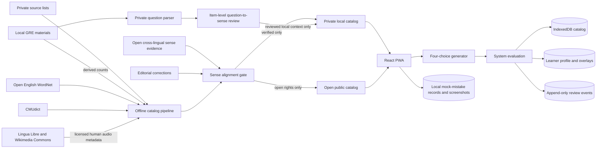

# Architecture

## Decision

GRE Verbal Lab is a database-first, local-first Progressive Web App. Catalog
construction happens offline; ordinary learning starts from the built catalog
and a four-choice question, not an import or self-rating screen.

## Runtime learning loop

1. Load a due sense or a stable 70/30 new-word plan.
2. Reject any sense that is not `alignmentState: "verified"` or lacks an
   eligible sourced example.
3. Generate one correct Chinese definition and three distinct, plausible
   distractors while excluding synonyms and near-duplicate meanings.
4. Record the learner's selection and optional response time.
5. Infer the review result from correctness, prior attempts, recent lapses, and
   optional latency.
6. Reveal meaning, relationships, example provenance, and scheduling feedback.
7. Append a wrong answer to the end of the current session and shorten its next
   interval.

The learner never needs to declare “I remember this.” A first correct answer is
learning evidence but cannot establish mastery by itself.

## Audio path

1. Prefer embedded human recordings with per-file source and license metadata.
2. If absent, query Wikimedia Commons for an exact open recording and cache the
   metadata locally.
3. If no eligible human recording is available, offer system speech and label it
   as synthetic.

Audio media is cached on demand by the service worker. The app does not treat a
dictionary application's playback URL as permission to copy or redistribute its
recording.

## Runtime stores

- `catalog`: the active versioned static catalog.
- `profile`: settings, learning state, daily plans, manual overlays, and custom
  words.
- `reviewEvents`: independently keyed question attempts and mistake events.
- `profile.mockMistakes`: structured mock-test mistakes, local screenshot data,
  due schedule, and append-only re-attempt history.
- `state`: retained temporarily as the v1 migration source.

Catalog upgrades merge compatible sense IDs, keep personal overlays, and do not
delete the event log. The localStorage fallback remains a last-resort recovery
path, not the primary database.

## Daily planner

1. Normalize the learner's editable 1–200 new-word target.
2. Count new words already completed today and schedule only the remainder.
3. Select due learned senses that still pass the content gate.
4. Load or create the date's saved new-word plan.
5. Draw 70% from the eligible focus tier and 30% from the eligible long tail
   using weighted sampling without replacement.
6. Seed randomness with date, catalog version, and daily target so refreshes are
   stable.
7. Introduce one primary sense per new headword.
8. Persist a learner-requested additional batch before it begins so refresh
   restores its order and next unanswered item.
9. Alternate due reviews and new words; append wrong answers for same-session
   reinforcement.

## Private local question evidence

The structural corpus and human bindings are build-time private inputs. The
personal catalog receives only reviewed matches and keeps `confirmed_sense`
separate from `word_form_only`. Evidence appears only after a vocabulary answer
or inside the library; it does not weaken the formal content gate.

The public mode never requests `catalog.personal.json`. Its output directory is
checked for personal catalog files, and the open catalog/standalone serializer
scans for private field names, IDs, source filenames, and question text.

## Mock-test mistake loop

1. Save a screenshot-only draft or a structured question locally.
2. Activate it only after the question, original/correct answer, cause, and
   correct reasoning pass validation.
3. Put due records ahead of the archive.
4. Hide the solution until the learner submits a re-attempt; judge correctness
   against the stored answer before accepting difficulty feedback.
5. Update the interval and linked vocabulary reinforcement, retaining the full
   private review history.

Priority starts from catalog evidence and gradually shifts toward correctness,
lapse count, optional response time, mastery, due time, and linked mistakes.

## Rights and privacy boundary

- Personal source files and the private catalog never enter Git.
- Public builds use only content whose reuse terms permit publication.
- ETS questions and film or television dialogue remain references unless
  explicit redistribution permission exists.
- Personally held text may be attached through a local-only overlay; import does
  not grant publication rights.
- Open lexical data and recordings retain item-level provenance and attribution.
- No account is required; learning records remain in the browser by default.

## Technology

- React, TypeScript, Vite
- IndexedDB through `idb`
- dependency-free local XLSX cell reader for advanced import
- MediaWiki APIs for open audio discovery and metadata
- Vitest unit and integration tests plus catalog/quiz audits
- PWA manifest, service worker, and standalone private/public builds
